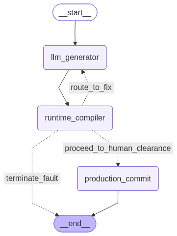

# ⚡ Enterprise AI Safe-Mesh: Resilient Multi-Agent Local Code Execution Engine

An asymmetric, production-grade multi-agent execution pipeline orchestrated via **FastAPI (with Async Lifespan Management)**, **LangGraph Async Engine**, and **Docker Compose**. This system implements a self-correcting, sandboxed compilation context utilizing a local, 4-bit quantized **Llama-3.2 (3B)** model running entirely on CPU/RAM infrastructure with zero third-party API dependencies.

---

## 🗺️ Architectural Topology & Core Flows

```
[Host Laptop Port:8000]
        │
        ▼ (Ingress Edge via FastAPI Lifespan Loop)
┌────────────────────────────────────────────────────────┐
│ FastAPI Gateway Service (backend-mesh-service)          │
└──────┬───────────────────────────────────────────────────┘
        │
        ▼ (State Tracking Init via AsyncSqliteSaver Connection Pool)
┌────────────────────────────────────────────────────────┐
│ LangGraph State Machine Memory Loop Matrix               │
│   ├── Node 1: llm_generator (Context Prompt Injection)   │
│   └── Node 2: runtime_compiler                            │
│         ├── Layer 1: AST static analysis                  │
│         │   (recursive import scan, signature check)      │
│         └── Layer 2: Isolated Docker Sandbox               │
│             (network_disabled=True, mem/cpu limits)        │
└──────┬──────────────────┬───────────────────────────────┘
        │                  ▲
        │ (On Crash Error) │ (Self-Correction Loop Iterations)
        └──────────────────┘
        │
        ▼ (Validation Passed - Stateful Persistence Frozen)
⛔ [SAFETY GATE INTERRUPT WALL] → Pending Admin Clearance Token Signatures
        │
        ▼ (Admin Stamped: "APPROVED")
┌────────────────────────────────────────────────────────┐
│ Node 3: production_commit (Permanent Disk Sync)          │
└────────────────────────────────────────────────────────┘
```

---

## 🗺️ Architectural Topology & Core Flows

<!-- 🎨 Adding the newly generated high-resolution diagram at the top -->


---

## 🔒 Security Architecture — Defense in Depth

Untrusted, LLM-generated code is never executed with full server privileges. Two independent layers guard execution:

**Layer 1 — AST Static Analysis (fast, cheap first-pass reject)**
Before any code runs, the full syntax tree is recursively walked (`ast.walk()`, not just top-level statements) to detect imports anywhere in the code — including inside nested functions, classes, or try blocks. Any import outside a strict standard-library allowlist is rejected before execution ever begins. Function signatures are also inspected (`inspect.signature()`) to reject any `compute_metrics` implementation requiring arguments, and generator functions (`yield`) are rejected in favor of `return` so results can be deterministically validated.

**Layer 2 — Network-Isolated Docker Sandbox (defense against static-analysis bypass)**
Even if Layer 1 were bypassed (e.g. via dynamic imports like `__import__()`), all code executes inside a disposable, per-request Docker container with `network_disabled=True`, memory limits, and CPU quotas. This guarantees that even a successful bypass cannot exfiltrate data or make outbound network calls — the sandbox has no network interface at all.

### Verifying the security layer

🧪 Deterministic Security Unit-Testing

Relying on an LLM to generate malicious code on demand to test safety blocks is highly non-deterministic due to model response variance. To address this, our validation suite directly targets the compilation gateway with handcrafted malicious payloads, completely bypassing the LLM step.

Our tests are written using Python's native unittest framework, ensuring a zero-dependency, highly stable execution inside our container stack.

Running the Test Suite

Execute the test suite inside the active running microservice container via Docker:

docker exec -it backend-mesh-service python -m unittest tests/test_security.py


Expected Output (All Blocked Successfully)

When executed, you will witness the static AST parser intercepting each specific attack vector prior to execution:

⚙️ [Compiler Node] Validating code string in sandboxed scope...
.⚙️ [Compiler Node] Validating code string in sandboxed scope...
.⚙️ [Compiler Node] Validating code string in sandboxed scope...
.
----------------------------------------------------------------------
Ran 3 tests in 0.012s

OK


---

## 📊 System Performance & Benchmarking Telemetry

Performance is measured via an async benchmarking harness (`benchmark.py`) that hits the live `/api/v1/execute` endpoint end-to-end — including any LLM self-correction retries, not just raw model inference. Two distinct measurements are captured because they answer different questions:

- **Sequential Benchmark** — one request at a time. Measures true per-task model speed with no queuing overhead. This is the number that reflects raw model performance.

================================================================================
📊 SEQUENTIAL BENCHMARK (Real Per-Task Model Speed)
================================================================================
| Scenario Layer | Tokens (real) | Compute Time (s) | Throughput (tok/s) | Round Trip (s) |
| :--- | :---: | :---: | :---: | :---: |
| **Lightweight Arithmetic Task** | 28 | 2.26s | 12.39 | 7.38s |
| **Medium Code Generation Logic** | 43 | 3.2s | 13.44 | 8.07s |
| **Heavy Structural Telemetry Logic** | 84 | 7.18s | 11.7 | 13.05s |


- **Concurrent Load Test** — three requests fired simultaneously. 

📊 CONCURRENT LOAD TEST (3 Simultaneous Requests)
================================================================================
| Scenario Layer | Tokens (real) | Compute Time (s) | Throughput (tok/s) | Round Trip (s) |
| :--- | :---: | :---: | :---: | :---: |
| **Lightweight Arithmetic Task** | 18 | 1.34s | 13.47 | 3.49s |
| **Medium Code Generation Logic** | 54 | 4.79s | 11.27 | 20.58s |
| **Heavy Structural Telemetry Logic** | 158 | 12.8s | 12.34 | 16.35s |
================================================================================

⏱️  Total wall-clock time for all 3 concurrent requests: 20.59s

Since Ollama processes requests one at a time internally (no parallel inference on this CPU setup), this measures total system throughput and queuing behavior under simultaneous load, not parallel model inference.

### Running the benchmark
```bash
docker compose up -d
python benchmark.py
```


> 💡 **Cost Efficiency Factor:** By migrating computational logic from cloud-hosted inference layers to a localized, containerized edge stack, inference operational costs are eliminated entirely while retaining complete data privacy — no third-party API calls are made at any point in the pipeline.

---

## 📁 Project Structure

```
enterprise-ai-safe-mesh/
├── main.py                    # FastAPI app, lifespan management, API endpoints
├── graph.py                    # LangGraph StateGraph definition (uncompiled)
├── state.py                     # TypedDict state schema with Annotated reducers
├── nodes.py                      # LLM generation, AST security checks, sandbox execution
├── benchmark.py                   # Async performance profiling harness
├── tests/
│   └── test_security.py            # Direct, deterministic security-layer tests
├── docker-compose.yml
├── Dockerfile
└── requirements.txt
```

---

## 🛠️ Infrastructure Setup

All services run inside isolated Docker containers on a custom bridge mesh network. Spin up the entire infrastructure locally in a single command:

```bash
docker compose up --build -d
```

This will:
1. Build and start the FastAPI gateway (`backend-mesh-service`)
2. Pull and start the Ollama inference engine (`ollama-cpu-engine`)
3. Automatically pull the `llama3.2` model on first run via the `ollama-init` service
4. Wire everything together on an isolated `mesh-network` bridge network

Once running, visit `http://localhost:8000/docs` for the interactive Swagger UI.

### Core Endpoints
| Endpoint | Method | Purpose |
| :--- | :---: | :--- |
| `/api/v1/execute` | POST | Kicks off the self-correcting code generation pipeline |
| `/api/v1/approve` | POST | Human-in-the-loop admin approval/rejection gate |